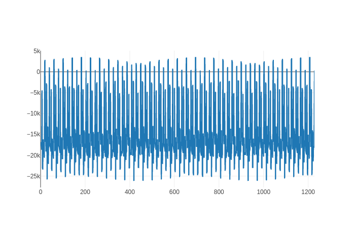

# BDF Parser

A parser for the BDF ("Biosemi Data Format") an EEG output format, and more specifically for the
24BIT version. Thanks to Rust and zero-copying the parser is very quick.

## Usage

The parser library provides several structures to work with the different aspects of the BDF format.

```rust
// a basic example
// --- snip ---

let bdf_file_path = "path/to/file";
let bdf_data = BDF::parse(bdf_file_path).unwrap();

let channels = bdf_data.body; //hashmap with channels (str labels) as keys, and Vectors as values

// --- snip ---
```

## Plot examples




## Acknowledgements

[Biosemi](https://www.biosemi.com/faq/file_format.htm)

Sample data and format specification

[FieldTripToolBox](https://crates.io/crates/byteorder)

Format specification

[UCSD](https://sccn.ucsd.edu/~arno/fam2data/publicly_available_EEG_data.html)

Sample data

[Plotly](https://crates.io/crates/plotly)

Graphing

[ByteOrder](https://crates.io/crates/byteorder)

Endian Calculations
